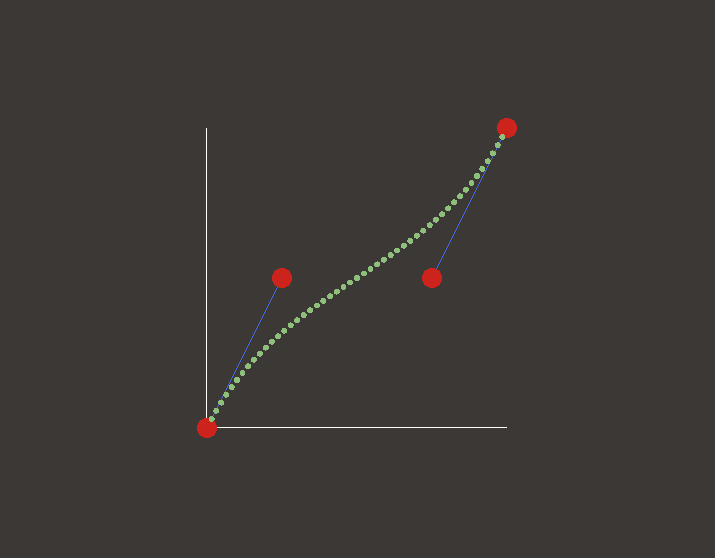

# Bézier-rs
This is a simple program that allows you to create a cubic [Bézier curve](https://en.wikipedia.org/wiki/B%C3%A9zier_curve), based
on 4 control points.

## How to run it?
This is a simple rust project, if you already got cargo installed, you can run
it by simply using the command:

```bash
cargo run
```

## Results
Here are some examples of the bézier curves you can create


